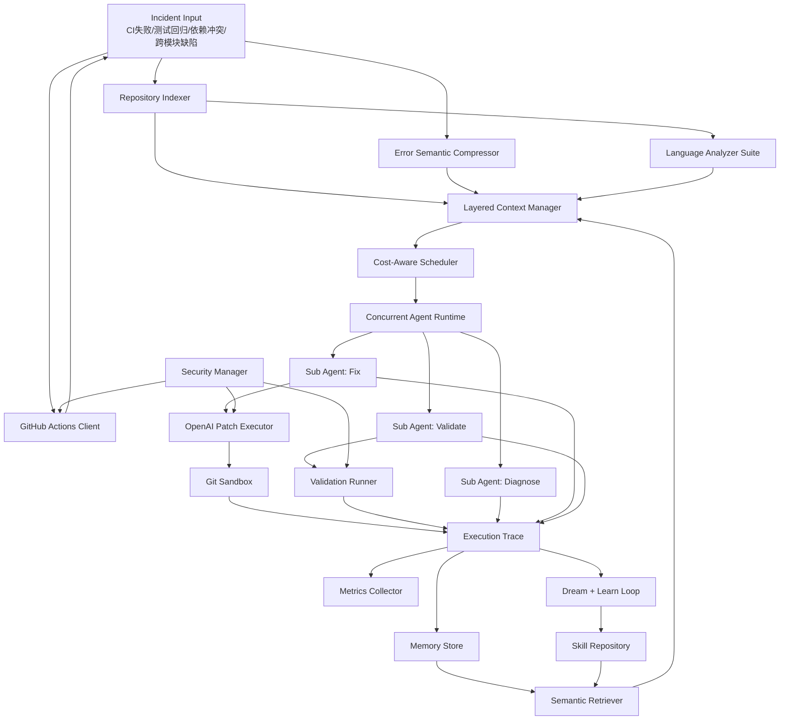

# 自进化代码维护 Agent 系统详细架构设计

## 1. 设计目标

平台面向代码仓库自治维护，核心目标不是单次修 bug，而是形成一套能够持续演进的仓库维护智能体基础设施：

1. 对仓库具备语义级理解能力，能在跨模块问题下快速缩小分析范围
2. 对任务具备拆解与调度能力，能在复杂问题上组织多 Agent 协同
3. 对历史任务具备复盘与学习能力，能把成功经验沉淀为可复用 Skill
4. 对系统运行具备可观测能力，能用指标驱动持续优化

## 2. 总体架构

## 3. 功能模块设计

### 3.1 RepositoryIndexer 仓库语义理解层

职责：

1. 扫描仓库源码与配置文件
2. 构建跨文件依赖图
3. 抽取调用边与文件摘要
4. 结合 incident 日志定位 relevant files

设计细节：

1. Python 文件使用 AST 抽取 import、函数定义和函数调用
2. Tree-sitter 可用时补充 JS/TS 等语言的符号定义与调用边
3. 无 Tree-sitter 依赖时自动退化到正则抽取 import / require
4. 文件摘要默认截取首段有效代码或配置内容
5. relevant files 评分由 stack frame、changed files、suspected modules、错误关键词共同决定
6. 输出 `symbols`、`graph_edges` 和 `graph_metadata`，为跨模块分析和调用链压缩服务

### 3.2 ErrorSemanticCompressor 执行报错语义压缩层

输出字段：

- `error_type`
- `error_name`
- `key_stack_frames`
- `keywords`
- `root_cause_cluster`
- `semantic_summary`
- `confidence`

设计细节：

1. 规则识别 Python Traceback、pytest、pip/poetry 依赖冲突、npm/yarn 依赖问题
2. 用关键词和栈帧联合生成 root cause cluster
3. 输出 summary 时避免携带原始长日志，减少 Token 消耗

### 3.3 LayeredContextManager 分层上下文管理

上下文层次：

1. `Working Context`：incident 摘要、关键日志、relevant files、局部依赖图
2. `Short-Term Memory`：最近执行轨迹和任务中间结论
3. `Long-Term Memory`：历史相似问题摘要和成功修复经验
4. `Skill Context`：命中的技能及其动作模板和成功率

设计细节：

1. Token 预算按层分配而不是平铺
2. 长日志先压缩再进入 Working Context
3. Memory 只提供摘要，不直接注入完整原始轨迹
4. relevant files 超限时按相关度截断

### 3.4 SkillRepository 技能库与治理层

每个 Skill 包含：

- 名称、描述、触发词、适用错误类型
- 动作模板
- 版本号
- 使用次数、成功次数、最近使用时间
- 来源轨迹列表

治理策略：

1. 多次使用但成功率过低的 Skill 自动降级或停用
2. 长时间未命中且成功率低的 Skill 自动淘汰
3. 相似 Learned Skill 不重复创建，而是并入旧版本并升级版本号

### 3.5 SemanticRetriever 语义召回与 rerank 层

职责：

1. 统一技能库与长期记忆的向量检索接口
2. 结合 embedding、词法重叠和成功率进行联合排序
3. 在远程 embedding 不可用时退化到本地哈希向量

设计细节：

1. `EmbeddingClient` 优先调用 OpenAI Embeddings API
2. `VectorCache` 将文本向量持久化到本地 JSON 缓存，减少重复开销
3. rerank 分数 = 语义相似度 + 词法重叠 + 历史成功率加权
4. 技能召回和记忆召回共享一套排序框架，便于后续接入向量数据库

### 3.6 CostAwareScheduler 成本感知调度层

输入信号：

- 错误类型
- 关键栈帧数量
- relevant files 数量
- 日志长度
- 技能命中情况
- 是否为跨模块问题

输出：

- 单 Agent 或多 Agent 决策
- 任务链拆解
- 每个 Agent 的上下文预算

### 3.7 Main Agent / Sub Agent 协同执行层

主 Agent：

1. 接收任务
2. 读取调度结果
3. 分派子任务
4. 汇总执行结果
5. 生成执行轨迹

子 Agent：

1. `Diagnose`：分析根因与影响范围
2. `Fix`：输出 Repair Plan
3. `Validate`：输出验证路径与回归保护建议

当前实现补充：

1. `Fix` 阶段已经接入 OpenAI Responses API 驱动的真实补丁执行器
2. LLM 输出被约束为结构化编辑列表，再由平台应用到沙箱仓库
3. `Validate` 阶段已能真实执行本地测试/CI 命令，而不只是给建议
4. `ConcurrentAgentRuntime` 已支持线程池/进程池并发执行任务
5. 每个任务会写入独立的运行目录并携带运行时元数据，便于隔离和审计

### 3.8 GitHubActionsClient 远程 CI 回流层

职责：

1. 拉取 GitHub Actions 失败 workflow run
2. 下载并解压日志，抽取失败摘要
3. 将远程 run 落盘成平台 incident
4. 在审批通过后触发 rerun 或 rerun failed jobs

当前实现策略：

1. 使用 GitHub REST API 拉取 workflow run 状态和日志
2. 将日志压缩为 incident metadata + logs 文本，复用本地分析链路
3. `github-sync`、`github-analyze`、`github-rerun` 三条 CLI 路径已接通
4. rerun 操作受审批策略保护，并记录审计事件

### 3.9 SecurityManager 安全治理层

职责：

1. 管理审批记录、TTL 过期与查询
2. 对 GitHub 写操作、远程执行和本地命令做权限校验
3. 记录审计日志，形成完整执行证据链

当前实现策略：

1. 审批信息存储在 `runtime/approvals.json`
2. 审计事件追加写入 `runtime/audit.jsonl`
3. GitHub rerun 与 repair 远程执行默认需要审批
4. 本地验证命令支持 allowlist + 审批双重约束

### 3.10 Dream + Learn Loop 自进化层

闭环步骤：

1. `Dream`：读取近期成功轨迹，聚合同类问题，提炼关键动作
2. `Learn`：生成新 Skill 或升级既有 Skill
3. `Govern`：按成功率、最近命中时间和版本情况治理 Skill

当前实现策略：

1. 从成功轨迹中抽取错误类型、根因簇、修复摘要和关键修复步骤
2. 若已存在近似 Skill，则合并触发词并升级版本
3. 若不存在，则创建 `learned-*` 技能

### 3.11 MetricsCollector 可观测与评估层

核心指标：

1. `skill_hit_rate`
2. `repair_success_rate`
3. `avg_token_usage`
4. `avg_task_chain_length`
5. `multi_agent_rate`
6. `validation_pass_rate`
7. `rollback_rate`
8. `github_incident_rate`
9. `retrieval_hits`
10. `runtime_backend`

当前存储：

- 执行轨迹：SQLite
- 观测指标：JSON Lines
- 技能库：JSON

### 3.12 GitSandbox 与回滚层

职责：

1. 为每次 repair 请求创建独立沙箱仓库
2. 对非 Git 仓库自动初始化 baseline commit
3. 在验证失败时回滚到 baseline commit
4. 在验证成功时生成修复 commit

当前实现策略：

1. 沙箱路径位于 `runtime/sandboxes/<job-id>`
2. 每个沙箱在执行前都会记录基线提交
3. 失败时执行 `reset --hard baseline + clean -fd`
4. 提交时通过 `.git/info/exclude` 排除 `__pycache__` 等运行产物

### 3.13 ValidationRunner 本地测试/CI 执行层

职责：

1. 推断默认验证命令
2. 执行 incident 自带的 CI / test commands
3. 收集 stdout / stderr 并在失败后回灌给 LLM 进行重试

当前实现策略：

1. 优先使用 incident metadata 中的 `validation_commands`、`test_command`、`ci_command`
2. Python 测试默认使用 `pytest`，若当前解释器不可用则退化到平台内置 lightweight test runner
3. 运行时自动注入 `PYTHONPATH`，保证沙箱仓库中的模块可导入

## 4. 核心数据流

### 4.1 运行态处理链路

1. 输入 incident
2. 压缩日志语义
3. 扫描仓库并构建语义快照
4. 检索相关技能与历史记忆
5. 组装分层上下文
6. 进行成本感知调度
7. 并发运行 Diagnose / Fix / Validate 子 Agent
8. 生成 Repair Plan 与验证方案
9. 如为 repair 模式，则进入 Git 沙箱、应用补丁并运行验证
10. 持久化 Execution Trace、审批记录与审计事件
11. 写入指标与技能表现

### 4.2 睡眠态学习链路

1. 读取近期成功轨迹
2. 过滤低价值样本
3. 提炼根因簇 + 修复动作
4. 生成或升级 Skill
5. 执行治理与淘汰

## 5. 分步骤实施方案

### Phase 1：平台主干

1. 项目骨架、领域模型、CLI
2. 仓库扫描与错误语义压缩
3. 分层上下文管理
4. 初版技能库

### Phase 2：自治执行链

1. 成本感知调度器
2. 主 Agent / 子 Agent 协同
3. Repair Plan 生成
4. 轨迹持久化

### Phase 3：自进化闭环

1. Dream + Learn Loop
2. Skill 版本升级与治理
3. 历史经验复用

### Phase 4：生产化增强

1. 向量检索、embedding 召回和技能/记忆 rerank
2. GitHub Actions 远程结果回流、日志下载与 rerun 触发
3. 线程池/进程池子 Agent 并发运行时与任务级隔离目录
4. 更细粒度的符号级分析、多语言代码图与可选 Tree-sitter 解析
5. 审批、审计、权限策略和远程执行安全治理

### Phase 5：后续工程化扩展

1. GitLab CI / Jenkins 等更多 CI 平台适配
2. 向量数据库、ANN 检索和 cross-encoder reranker
3. 容器 / 微虚机级运行时隔离
4. 企业级 RBAC、密钥托管、审计脱敏与策略中心
5. Tree-sitter 语法包和多语言解析依赖的环境预装

## 6. 当前实现与后续扩展边界

当前仓库里的代码已经覆盖了平台主干、真实补丁执行链和核心闭环，适合作为科研原型或后续工程化底座。它能够：

1. 读取 incident
2. 分析仓库上下文
3. 做调度决策
4. 通过 LLM 在 Git 沙箱里生成并应用真实补丁
5. 运行本地测试/CI 命令并在失败时回滚
6. 沉淀历史轨迹
7. 自动复盘学习技能
8. 输出观测指标
9. 同步 GitHub Actions 失败 run 并触发 rerun
10. 用 embedding + 词法融合召回技能与长期记忆
11. 构建多语言符号图并在并发运行时中执行子 Agent
12. 对敏感操作实施审批、审计与权限控制
